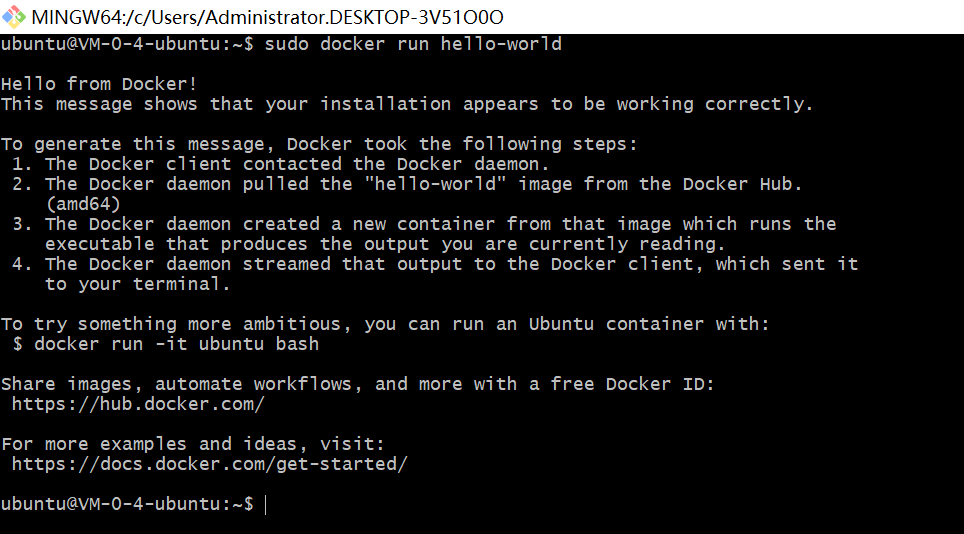

## 简介

*Docker 的架构图如下所示*


*Docker 是一个开源的应用容器引擎，基于 Go 语言并遵从 Apache2.0 协议开源。Docker 可以让开发者打包他们的应用以及依赖包到一个轻量级、可移植的容器中，然后发布到任何流行的 Linux 机器上，也可以实现虚拟化。容器是完全使用沙箱机制，相互之间不会有任何接口( 类似 iPhone 的 app ),更重要的是容器性能开销极低。Docker 从 17.03 版本之后分为 CE( Community Edition: 社区版 )和 EE( Enterprise Edition: 企业版 )，一般来说社区版就够我们使用的啦. Docker的应用场景如下所示 :*

* Web 应用的自动化打包和发布
* 自动化测试和持续集成、发布
* 在服务型环境中部署和调整数据库或其他的后台应用
* 从头编译或者扩展现有的 OpenShift 或 Cloud Foundry 平台来搭建自己的 PaaS 环境


## Install Docker Engine on Ubuntu
*在 Ubuntu 18.04 上安装 Docker CE 的流程如下所示.*


### 前提条件
*若要安装 Docker Engine，你需要以下版本的Ubuntu( 64位版本 ) :*
* Ubuntu Focal 20.04( LTS )
* Ubuntu Eoan 19.10
* Ubuntu Bionic 18.04( LTS )
* Ubuntu Xenial 16.04( LTS )


### 预载新版本
*`docker`，`docker.io`或`docker-engine`称为Ubuntu 的旧版本，如果你已安装这些，请先卸载它们 :*
```shell
$ sudo apt-get remove docker docker-engine docker.io containerd runc
```


### 安装方法
*Docker的安装方法共有以下三种，这里选择 `通过仓库安装` 的方法，即在新主机上首次安装Docker Engine之前，需要先设置Docker仓库。之后才可以从存储库中安装及更新Docker.*
* 通过仓库安装
* 从安装包中安装
* 使用便捷脚本安装

#### 设置存储库
1. *更新apt软件包索引，并安装软件包以允许apt通过HTTPS使用存储库 :*
```shell
$ sudo apt-get update

$ sudo apt-get install \
    apt-transport-https \
    ca-certificates \
    curl \
    gnupg-agent \
    software-properties-common
```

2. *添加Docker的官方GPG密钥 :*
```shell
$ curl -fsSL https://download.docker.com/linux/ubuntu/gpg | sudo apt-key add -
```

*( `9DC8 5822 9FC7 DD38 854A  E2D8 8D81 803C 0EBF CD88` )通过搜索指纹的这后8个字符来验证你现在是否拥有带有指纹的密钥 :*
```shell
$ sudo apt-key fingerprint 0EBFCD88

pub   rsa4096 2017-02-22 [SCEA]
      9DC8 5822 9FC7 DD38 854A  E2D8 8D81 803C 0EBF CD88
uid           [ unknown] Docker Release (CE deb) <docker@docker.com>
sub   rsa4096 2017-02-22 [S]
```

3. *使用以下命令将仓库设置为稳定的(`stable`)存储库。若要添加`nightly`或`test`的存储库，请将 nightly 或 test( 或两者 )添加到单词 stable 后面 :*
```shell
$ sudo add-apt-repository \
   "deb [arch=amd64] https://download.docker.com/linux/ubuntu \
   $(lsb_release -cs) \
   stable"
```

#### 安装DOCKER引擎
1. *首先更新 apt 程序包索引，其次安装最新版本的 Docker Engine 和容器，或直接执行第二条命令来立即安装 Docker Engine :*
```shell
$ sudo apt-get update
$ sudo apt-get install docker-ce docker-ce-cli containerd.io
```

2. *若要安装特定版本的Docker Engine，有如下两种方式 :*

* 方式一 : 列出存储库中可用版本，然后选择性安装 :
```shell
$ apt-cache madison docker-ce

  docker-ce | 5:18.09.1~3-0~ubuntu-xenial | https://download.docker.com/linux/ubuntu  xenial/stable amd64 Packages
  docker-ce | 5:18.09.0~3-0~ubuntu-xenial | https://download.docker.com/linux/ubuntu  xenial/stable amd64 Packages
  docker-ce | 18.06.1~ce~3-0~ubuntu       | https://download.docker.com/linux/ubuntu  xenial/stable amd64 Packages
  docker-ce | 18.06.0~ce~3-0~ubuntu       | https://download.docker.com/linux/ubuntu  xenial/stable amd64 Packages
  ...
```

* 方式二 : 通过修改第二列中的版本字符串( VERSION_STRING )来安装特定版本，例如 : `18.09.1~3-0~ubuntu-xenial`
```shell
$ sudo apt-get install docker-ce=<VERSION_STRING> docker-ce-cli=<VERSION_STRING> containerd.io
```

#### 测试
*通过运行 hello-world 映像来验证是否正确安装了Docker Engine. 此命令会下载测试图像并在容器中运行，容器运行时，它会打印参考消息( `hello from Docker` )并退出 :*
```shell
$ sudo docker run hello-world
```


#### 升级DOCKER引擎
*要升级Docker Engine，请先运行sudo apt-get update，然后按照以上安装说明进行操作，选择要安装的新版本*


### 卸载Docker
1. *卸载Docker Engine，CLI以及Containerd软件包 :*
```shell
$ sudo apt-get purge docker-ce docker-ce-cli containerd.io
```
2. *主机上的映像，容器，卷或自定义配置文件不会自动删除。若要删除所有图像，容器和卷请执行以下命令 :*
```shell
$ sudo rm -rf /var/lib/docker
```


### 常用命令
```shell
# 使用指南
$ docker
# 查看版本号
$ sudo docker version
# 查看镜像
$ sudo docker images
# ...
```


### 参考
*菜鸟教程 : [Docker Tutorial](https://www.runoob.com/docker/docker-tutorial.html)*

*Docker Document : [Install Docker Engine on Ubuntu](https://docs.docker.com/engine/install/ubuntu/)*
