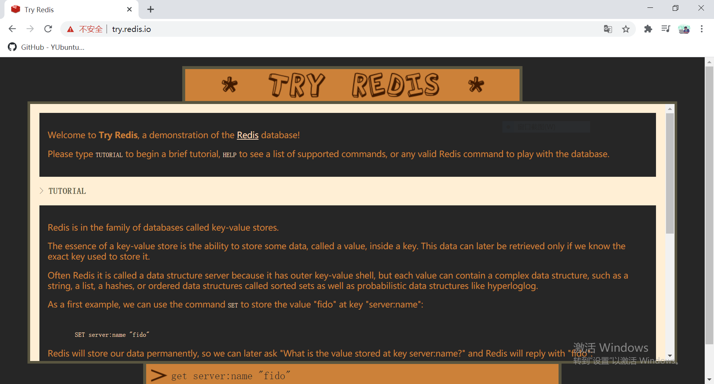

## Ubuntu 18.04
### 简介
*REmote DIctionary Server( `Redis` ) 是一个由 Salvatore Sanfilippo 写的 key-value 存储系统。Redis是一个开源的使用ANSI C语言编写、遵守BSD协议、支持网络、可基于内存亦可持久化的日志型、Key-Value数据库，并提供多种语言的API。它通常被称为数据结构服务器，因为值(value)可以是 字符串(String), 哈希(Hash), 列表(list), 集合(sets) 和有序集合(sorted sets)等类型。*


### 安装
```shell
> sudo apt-get install redis-server
```

### 检查Redis服务器系统进程
```shell
> ps -agx|grep redis
```

### 通过启动命令检查Redis服务器状态
```shell
> netstat -nlt|grep 6379
```

### 通过命令行客户端访问Redis
```shell
> redis-cli

# test
127.0.0.1:6379:> set firstKeyName firstKeyValue
127.0.0.1:6379:> get firstKeyName 
127.0.0.1:6379:> "firstKeyValue"
```

### 启动与停止
```shell
# stop
> sudo srevice redis stop
# restart
> sudo srevice redis restart
```

### 设置密码
*默认情况下无密码哟 : 找到 /etc/redis/redis.conf 文件，添加 `requirepass mypassword`*
```shell
> vim /etc/redis/redis.conf

# test
> redis-cli
> auth mypassword # input your password
OK
127.0.0.1:6379:>
```

### 教程
*在这里你可以提前体验并学习以下 Redis 的使用 : http://try.redis.io/*



## Windows 10
> *Windows 10操作系统中如何下载并使用 Redis 请参考 : https://yubuntu0109.github.io/2019/06/25/Hi-Redis/*
