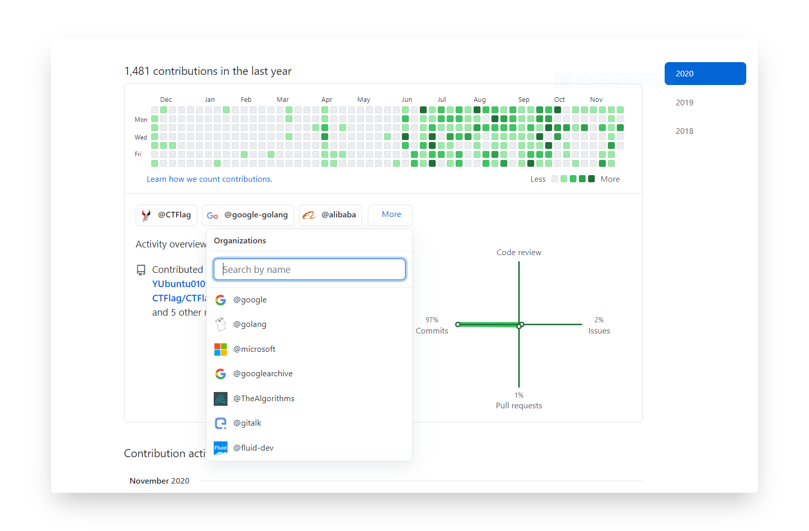
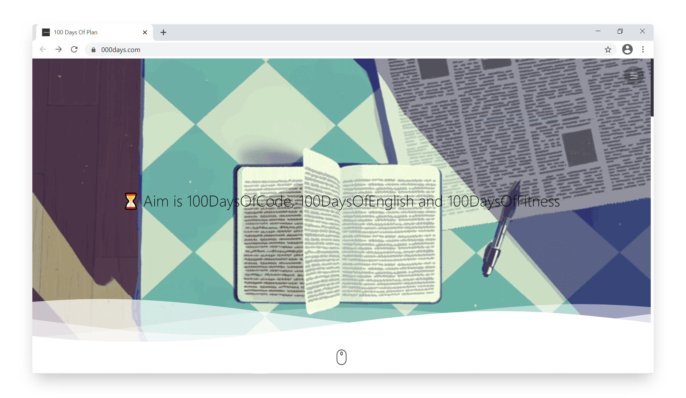
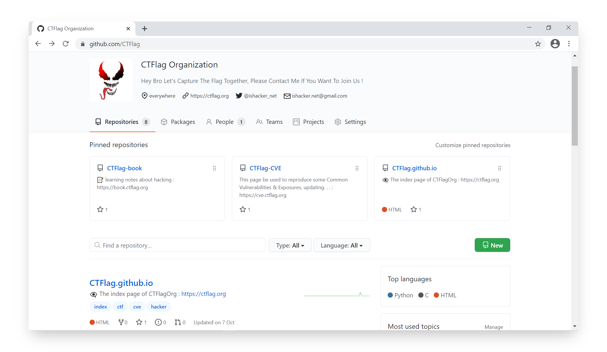
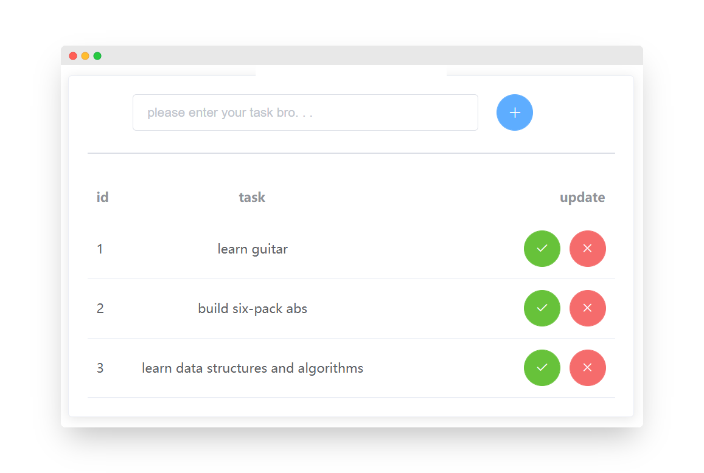
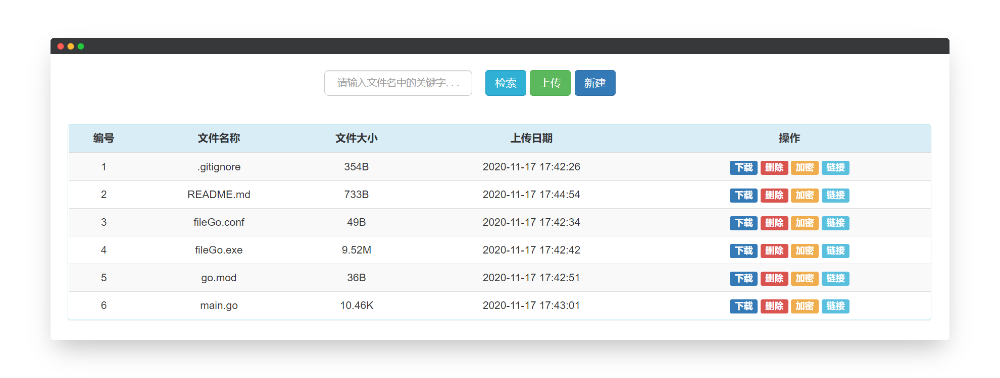
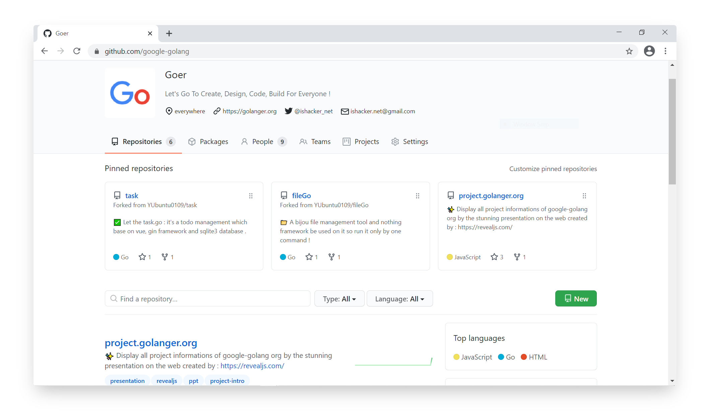
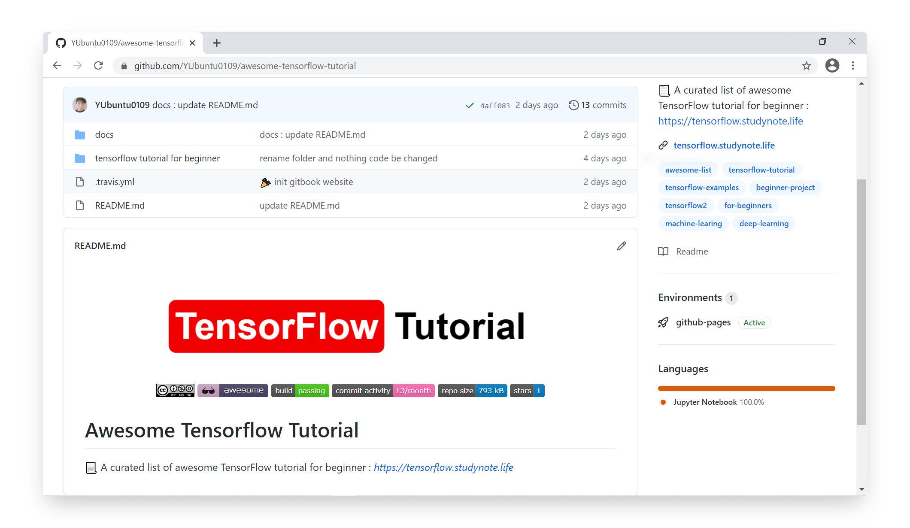

# 嘿集美们 ! 好久不见想我了嘛 ?
当我打开 VSCode 并执行 `hexo new` 这条命令生成这个博客时,已经是 `2020 年 11 月 26 号` 了 ! 要知道上次发布博客是 `2020 年 06 月 26 号`, 很明显我已经 `5` 个月没有发布新的博客文章了啊! 但是这段时间内我并没有偷懒哟~ 接下来让我带你们一起回顾下在这消失将近半年的时间里我都做了哪些事情吧 ! 二话不说先来晒下 `2019 年 12 月到 2020 年 11 月` 我的 GitHub 的活跃度吧~

# 消失这段时间内所做的事情
从高到底按照时间 `从远到近` 如下所示哈, 对了! 文章末尾有 `彩蛋🥚` 哟~

## 刷 LeetCode 并开源了 leetcode-googtech 项目
* 暑假时花了一个月时间考到了 `驾照`, 因练车的人很多, 进而导致学车时会产生很多时间碎片, 所以为了充分这些时间碎片我制定了 `LeetCode` 刷题计划, 到目前为止已经刷了 `230` 道题目, 其中大多数为 `数据结构` 类型的题目, 毕竟这对于我 `考研` 有很大的帮助.  最后我把这些我刷过的每道题目的代码都写了非常非常非常详细的注释, 并取名为 [`leetcode-googtech`](https://github.com/yubuntu0109/leetcode-googtech) 项目开源到 GitHub. 然后利用 `GitBook` 插件搭建了一个静态网页, 以供方便大家学习及参考哈, 当然也非常欢迎你的建议及贡献 ! 该项目的域名为 : *https://algorithm.show* .

> github address : https://github.com/yubuntu0109/leetcode-googtech

## 九月份开学后尝试制定每日计划
* 九月份终于开学啦🎉, 这一年有很多利于我将来职业发展的专业课需要去深入学习, 所以说每天的时间都会被安排的满满的, 我还来特意买了一个每日计划记录本及一个每日计划打卡本, 如下图所示. 在没有买它们之前为了记录这些日常计划, 我特意使用 `Python` 写了 200 多行代码构造了一个[`小工具`](https://github.com/YUbuntu0109/000days/blob/Hexobackup/py/plan.py), 其用于一键自动爬取日计划的封面图并将我的日计划打卡情况部署到我的远程 [`GitHub 仓库`](https://github.com/YUbuntu0109/000days), 所以说你要做的事情从执行各种 `hexo` 命令到仅需更新下今日计划的打卡情况即可. . . 但是我现在停止更新这个站点了, 因为我发现每日计划中有些隐私是我不想公开的! 该项目的域名为 : *https://000days.com* .

> github address : https://github.com/YUbuntu0109/000days

## 创建 CTFlag 组织
* 不知不觉中 `十月一国庆节` 到了, 学校给了我们 `七` 天的假期. 由于学校离家很远所以说我毅然决然地放弃了回家, 再者我爸妈及妹妹都在外地也不在家. . . 国庆节室友都回家或找 `女朋友` 去了( 写的这里脸上莫名流下了两行热汗/(ㄒoㄒ)/ No Girlfriend 555~~ ), 仅剩我自己窝在寝室学习 `CTF( Capture The Flag )`. 其实大二下学期时我就想学习它了, 但是由于学业上的压力及其烧脑的操作最终让我暂停了学习. . . 现在我又再次将它捡起来啦嘿嘿, 毕竟感兴趣兴趣嘛~ `其实我这个人最大的缺点就是写代码及学习新的技术栈时太投入且不懂得合理分配时间, 毕竟太喜欢 Coding 了啊`, 例如国庆假期期间我又又又没日没夜的学习 CTF, 进而导致不按时饮食、睡眠不充足、拖延其它学习计划及没有坚持健身等等等! 最后我在 GitHub 上面创建了 [`CTFlag Organization`](https://github.com/CTFlag) : 其用于开源一些关于 CTF 的学习笔记、黑客教程、及复现各种操作系统的漏洞等. 如果你对 CTF 感兴趣或想成为一个 `Hacker`, 那么欢迎加你入我们, 相互交流哟( 尽管我现在也只是一个小白白哈哈 ), 该组织的域名为 : *https://ctflag.org* .

> github address : https://github.com/CTFlag

## 学习 Golang 语言及开源了一些练手小项目
* 其实在暑假时就一直想学习 `Golang Programming Language`, 因为它是爸爸是 `Google` ( 我一直以来的梦想 ), 好吧开个玩笑哈~ 其实 Golang 语言的产生是为了弥补其他高级语言的缺陷及应对当今时代所需, 例如它有着 `Python` 的简洁, 及 `Java` 的性能, 而且它还打破了 `传统面向对象` 的概念! 在这个处处可能会产生高并发的网络时代中 Go 语言已经成为了程序员必学的一门语言! 在这里我推荐 GitHub 开源的两本关于 Go 语言编程入门的书籍哈, 写的很详细且通俗易懂, 其链接在下面. 我当时大概利用两天课下时间就把其基本语法学 `废` 啦, 然后作为总结写了一个名为 [`task`](https://github.com/yubuntu0109/task) 的小 demo : ✅ it's a todo management which base on vue, gin framework and sqlite3 database .

> 《The Way to Go》中文译本，中文正式名《Go 入门指南》: https://github.com/unknwon/the-way-to-go_ZH_CN

> A golang ebook intro how to build a web with golang : https://github.com/astaxie/build-web-application-with-golang

> Task project : https://github.com/YUbuntu0109/task

当然, 当你学习完 Golang 的基本语法后写一个小 demo 作为总结是远远不够的哈, 这里我再推荐一个适合 Go 语言初学者的小 demo 哈, 即名为 [`fileGo`](https://github.com/yubuntu0109/fileGo) 的小项目 : 📁 A bijou file management tool and nothing framework be used on it so run it only by one command !

> fileGo project : https://github.com/YUbuntu0109/fileGo

## 创建 google-golang 组织
* 在接触 `Golang` 一周左右后, 我发现我真的深深喜欢上了这门 Programming Language, 于是在周末创建了 [`google-golang organization`](https://github.com/google-golang), 其用于召集热爱 Go 语言的程序开发者, 一起来开发及维护一些有趣的 Golang 项目. 嘿集美! 如果你对 Golang 语言感兴趣或者像我一样是一个初学者, 那么欢迎你加入我的们的 `Golang Family`, 一起来学习及谈论有关 Golang 语言的技术鸭~ 该组织的域名为 : *https://golanger.org* .

> google-golang org github address : https://github.com/google-golang

> www.project.golanger.org github repo address : https://github.com/google-golang/project.golanger.org

## 想要学习 TensorFlow
* Google 于这个月的 16 号启动了 `Google 2020 开发者大会`, 其分为 6 天举行, 即 21 号下午 13:00 是最后一场! 毫无疑问线上大会的演讲及互动性并没有现场有激情, 毕竟今年初爆发的疫情( `COVID-19` )到现在也没有太大的好转, 还是只能靠隔离来尽量控制疫情的传播, 愿在 `2021 除夕夜` 来临之前各地区都可以解封, 进而可以与亲人们相聚一堂, 举杯欢笑~  在看完 Google 开发者大会后我深深地被 `TensorFlow` 吸引住了! 它最初是由谷歌大脑团队开发, 于 2015 开源的一个深度学习框架( `Deep Learning Framework` ). 众所周知, 深度学习是机器学习( `Machine Learning` ) 的一个分支啦. 对了, Google 在 MOOC 上还启动了名为 `Grow With Google` 的课程计划, 其中就包括了 `TensorFlow 入门及实战` 等教程. 如果你的英文不太好可以去参加并学习下这个根据 TensorFlow 官方教程汉化来的课程哈! 最近临近期末考试压力很大, 所以不可能再花课下时间去学习 TensorFlow 了, 尽管我已经使用 `gitbook` 插件搭建好了 TensorFlow 学习笔记的站点hhh, 其域名为 : *https://tensorflow.studynot.life* . 寒假再学习它吧 !

> TensorFlow 入门实操课程( MOOC ) : https://www.icourse163.org/course/youdao-1460578162

> 《机器学习基础》系列课程( Bilibili ) : https://www.bilibili.com/video/BV1Ja4y1W7as

> github address : https://github.com/YUbuntu0109/awesome-tensorflow-tutorial

# 🥚 彩蛋
下面是两篇待发布的且无关 `Coding` 的博文. . . 看这标题算不算一个大彩蛋🥚呢嘿嘿~ 最近临近期末考试, 所以说每天都有很多日计划需要去完成, 我会尽快发布以下两篇文章的! See You Again ヾ(•ω•`)o~

* [`《 拖延了三年后终于开始学习吉他了, 快来听下哈 ! 》`](待更新...)
* [`《 连续魔鬼式健身 100 天后, 我终于拥有了六块腹肌 ! 》`](待更新...)
